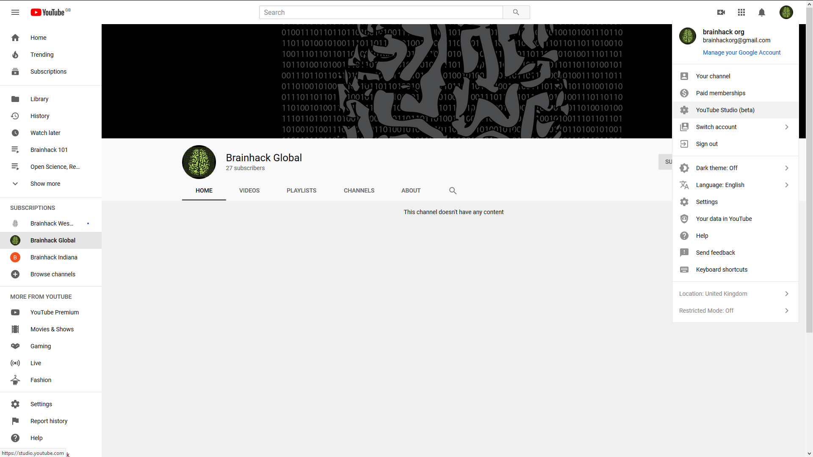
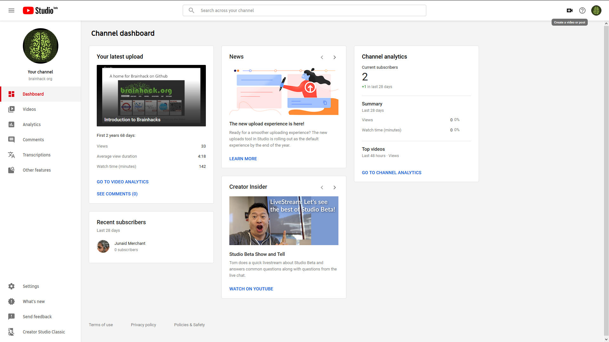
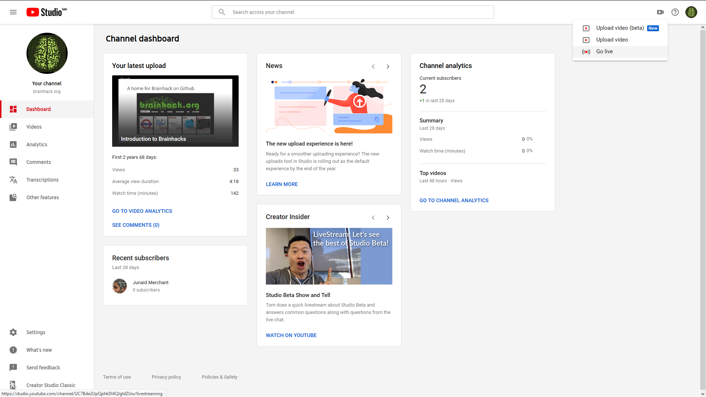
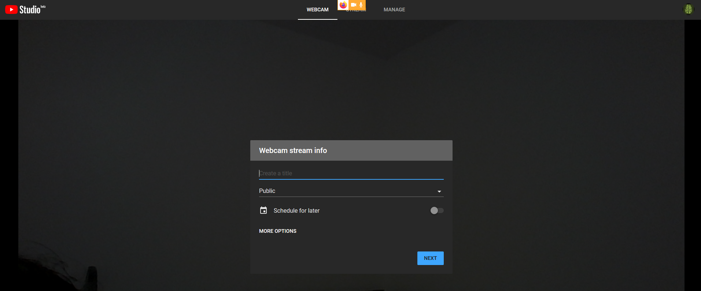
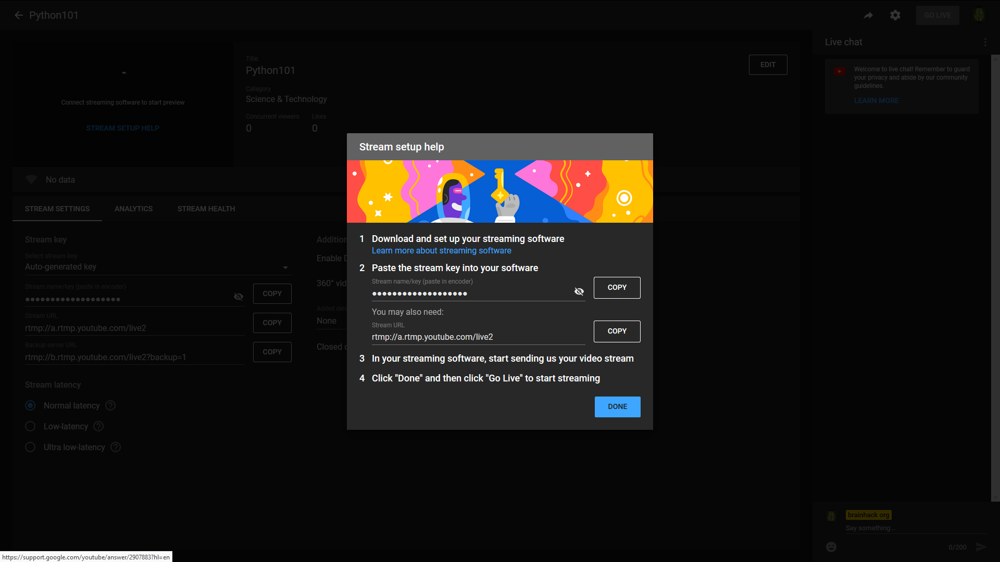

# Broadcasting your Brainhack

Hello, brainhacker! First of all, thank you for your interest in broadcasting
your Brainhack - this is what makes the community stronger!

This guide is both a primer on the resources you will need and a first steps
guideline to successfully broadcast your Brainhack. Note that is not intended
to be a complete, self-contained guideline for every possible broadcasting
tool.

You will need to gather the necessary equipment, take the necessary steps to
configure the required system of your choice, and test the setting a few days
before the event.

## Broadcasting Equipment

In order to broadcast your Brainhack, make sure you have the following
equipment:

1. **Camera**. You will need a tripod to hold the camera. If you have no
access to a camera, you may want to use a webcam, although the quality of your
broadcast is likely not to be satisfying.
2. **Audio/Microphone**. Ideally a wireless microphone will be required for the
speakers. This allows to minimize the ambient noise and thus to improve the
audio quality. Note that during the question time, it is recommended that the
speaker repeats the question to improve the experience both for the on-site
attendees and the live audience.
3. **Light**. Make sure that the projection screen have an appropriate lighting
conditions both for the on-site ateendees and the live audience.
4. **Internet connection**.

## Broadcasting Procedure

This guide assumes that the event will be broadcasted using a YouTube channel.
Although the broadcasting procedure may vary depending on the software you use
or the resources you have, you will generally want to:

1. Set up the broadcasting software.
2. Set up the YouTube Live dashboard.
3. Sync YouTube with the broadcasting software.
4. Go live
   1. Assess quality
   2. Manage comments.
5. Finish the broadcasting.
6. Publish the videos.

In order to broadcast you Brainhack, and depending on the options offered by
your broadcasting software, you may want to
- Cover both the speaker and the projection screen within the same view.
- Directly broadcast the slides and use a smaller region on top with the
  recording view of the speaker.

## Broadcasting Software

In this section you will find a list of software tools that will allow you to
broadcast your Brainhack.

### Youtube

1. Create a `Google` account if you do not have one.

2. Go to your `Youtube` page with your `Google` account.

3. Create a channel for your Brainhack.

4. Go to the main menu on the right top and click `Youtube Studio`.

5. Click on the tiny small recorder icon on the top right.

6. Choose to `Go live` from the menu.

7. Depending on the recording device you are using:

   1. If you will be using the computer's **webcam**, make sure that you are
   using `Chrome 60+` and `Firefox 53+`.

      1. Select `Webcam` at the top.

      

      2. Allow your browser to access your webcam.

      3. Enter a title and description, and select a privacy setting. You can
      also schedule your live stream for a later date.

      

      4. Click `More options > Advanced Settings` for more settings.

      

      5. Click `Save`. Your camera will then take a thumbnail.

      6. Click `Go Live`.
      

   2. If you will be using an **external webcam**

      1. Select the stream from the upper menu and fill the necessary descriptions 
      in the pop-up menu.

      

      2. Select the [stream encoder](
      https://support.google.com/youtube/answer/2907883?hl=en).

8. Allow your browser to access your microphone.

9. When you're done streaming, click `End Stream` at the bottom. All streams
under 12 hours will be automatically archived. You can access previous,
current, and upcoming streams in the `Live Tab`.

Note: To access and/or launch a scheduled live stream, go to the `Live Control
room` and select `Manage`.

Please visit the official [YouTube Live Stream help](
https://support.google.com/youtube/topic/9257891?hl=en&ref_topic=9257610) for
further details or troubleshooting.

### Open Broadcaster Software (OBS)

For the quick help for streaming with OBS you can have a look at this [wiki page](https://obsproject.com/wiki/OBS-Studio-Quickstart)

For more details on how to make advance set ups please visit the [OPBS Studio Wiki](https://obsproject.com/wiki/).

Those everal Youtube tutorials listed below might also be helpful to go over and set your streaming via OBS please do have a look at those videos. 

[How To Use OBS Studio To Live Stream - Twitch and YouTube](https://www.youtube.com/watch?v=BgpDb1XDDfY)

[OBS Studio Tutorial 2018](https://www.youtube.com/watch?v=j2HzbY8E4yQ)

### VLC media player

We would recommend you to visit [VLC media player Streaming HowTo documentation](
https://wiki.videolan.org/Documentation:Streaming_HowTo_New/#Streaming_using_the_GUI) for quick and very clear instructions about how to stream guideline with screenshots showing the menu choices.

### Zoom

Zoom is a meeting platform provides many features for discussions and streaming. If you would prefer an enviroment that allows your followers to engage with your streaming via [chat function](https://support.zoom.us/hc/en-us/articles/203650445-In-Meeting-Chat) you can also use this platform. For more detailed explanation on how to set up the tool please visit [Broadcast using a Zoom Room or Desktop Client](
https://support.zoom.us/hc/en-us/articles/360024605572-Broadcast-using-a-Zoom-Room-or-Desktop-Client).

